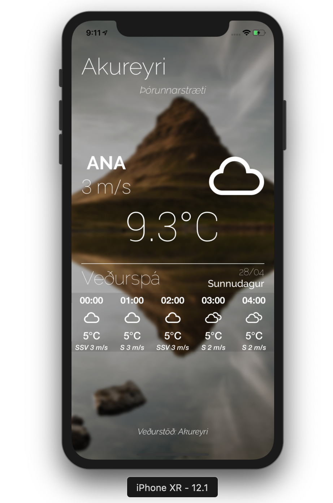

# Icelandic Weather - Veður
**Atuhor: Benedikt Óskarsson**

## About the App

This app was developed in 2017 and uses real-time observation and forecast data from the Icelandic meteorological office. The apps uses the user location to show observation from the nearest weather station and forecast for the area.

  

The app works well for its purpose but could defiantly be improved by letting the user get forecast and observations for other station then the nearest one and be able to provide weather information for other countries.
